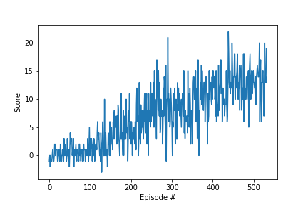

# Udacity Deep Reinforcment Learning Nanodegree 
## Project 1: Navigation:
 This is my implementation of Navigation project from Udacity NanoDegree program (Deep Reinforcement Learning)

### Introduction

The goal for this project is to train an agent to navigate in a large, square world. In addition to navigation, the agent has to learn to collect yellow bananas, while avoiding the blue ones! -[ScreenShot](./Results/EnvironmentIntro.png)

A reward of +1 is provided for collecting a yellow banana, and a reward of -1 is provided for collecting a blue banana.  

This task is episodic, and the condition to solve the environment is, to collect an average score of +13 or more, over 100 consecutive episodes.

### Setup Instructions:
#### Requirements

The python packages needed are shown in requirements.txt

To train an agent capable of collecting bananas, you should first clone this repo and also download (and locate in the same folder) the unity environment according to the OS you're using. The steps are:

1. Download the environment from one of the links below.  You need only select the environment that matches your operating system:
    - Linux: [click here](https://s3-us-west-1.amazonaws.com/udacity-drlnd/P1/Banana/Banana_Linux.zip)
    - Mac OSX: [click here](https://s3-us-west-1.amazonaws.com/udacity-drlnd/P1/Banana/Banana.app.zip)
    - Windows (32-bit): [click here](https://s3-us-west-1.amazonaws.com/udacity-drlnd/P1/Banana/Banana_Windows_x86.zip)
    - Windows (64-bit): [click here](https://s3-us-west-1.amazonaws.com/udacity-drlnd/P1/Banana/Banana_Windows_x86_64.zip)
    
   

### Results

The best model found was a DQN agent with Batch Normalization, able to solve the environment in only 234 episodes! This was achieved after a careful hyperparameter tuning, leading to a significant improvement compared to the initial base case settings.

